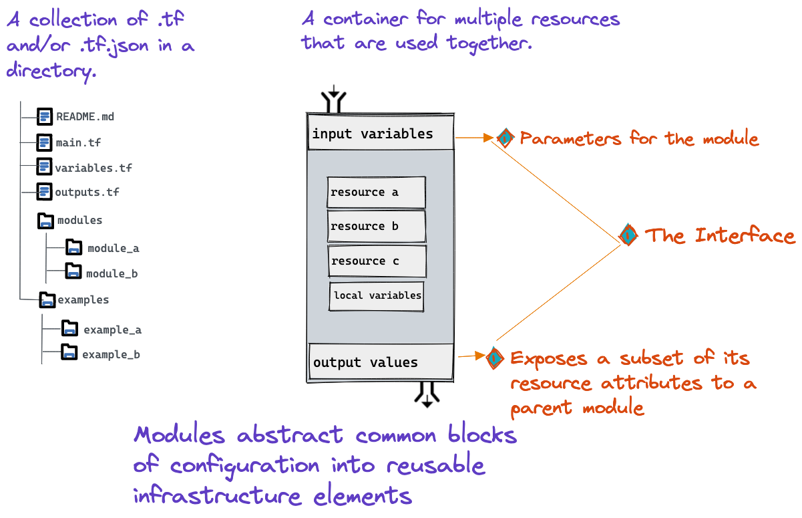
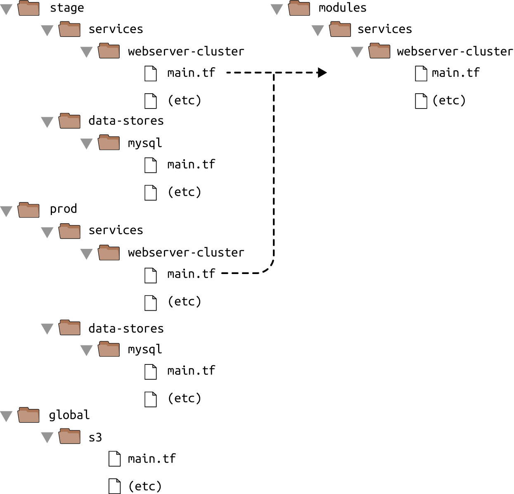
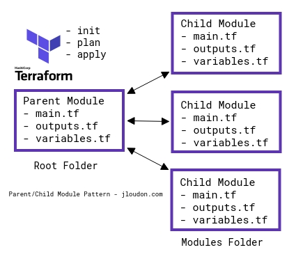

What Is a Terraform Module?
A Terraform module is a collection of standard configuration files in a dedicated directory. Terraform modules encapsulate groups of resources dedicated to one task, reducing the amount of code you have to develop for similar infrastructure components.

Some say that Terraform modules are a way of extending your present Terraform configuration with existing parts of reusable code reducing the amount of code you have to develop for similar infrastructure components. Others say that the Terraform module definition is a single or many .tf files stacked together in their own directory. Both are correct.

Module blocks can also be used to force compliance on other resources—to deploy databases with encrypted disks, for example. By hard-coding the encryption configuration and not exposing it through variables, you’re making sure that every time the module is used, the disks are going to be encrypted. 

A typical module can look like this:

.
├── main.tf
├── outputs.tf
├── README.md
└── variables.tf


As you can see, practically any Terraform configuration is already a module in itself. If you run Terraform in this directory, those configuration files would be considered a root module. It means that this configuration is the base of your operation, a core that you can expand further.

How To Use Terraform Modules

you’ll learn how to build a Terraform module that you can use to create a basic AWS EC2 instance

# Prerequisites to Build Terraform Module Example

This tutorial will be a hands-on demonstration. If you’d like to follow along, be sure you have the following:

- An AWS account – If you don’t have an AWS account, a free tier account is available.
- An EC2 instance with Terraform installed – This tutorial uses Terraform v0.14.4.
- An installed and configured AWS CLI.

# Setting up a Directory Structure
- Why must you set up terraform project directory structure in the first place? Firstly, Terraform needs a directory structure to organize your scripts and files like other programming languages.Secondly, Terraform uses a .tf file to describe main Terraform configurations, and other terraform files (.tf states) to describe Terraform resources.

- Terraform reads configurations from the root directory when it starts, so terraform configurations must be in the root directory.

- 1. Open your terminal and run the following commands to create a new directory named terraform_project and switch to that directory. You can name the directory differently as you prefer. This directory will hold all the files and subdirectories for this project.

```
mkdir terraform_project
cd terraform_project
```
- 2. Run the mkdir command below to create two directories. First is modules, a parent directory, and vpc, a subdirectory of the modules directory.

```
mkdir -p modules/vpc
```

- 3. Finally, run the following command to change your current directory to the vpc directory inside the modules directory using an absolute path. Be sure to replace cloud_user with your username.

You specify the absolute path of the vpc directory since each user in your system has their own home directory.


[]
[]
[]
[]